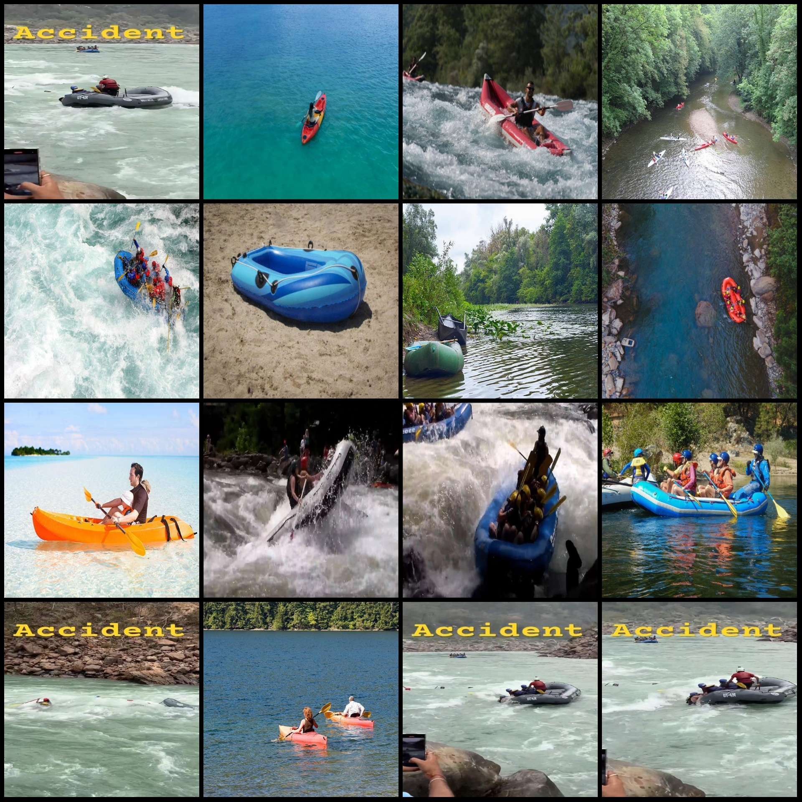
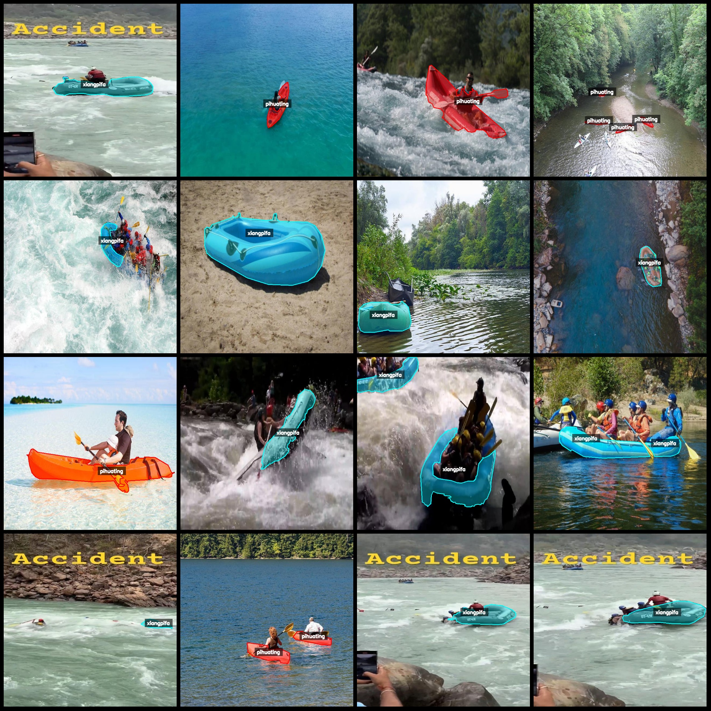
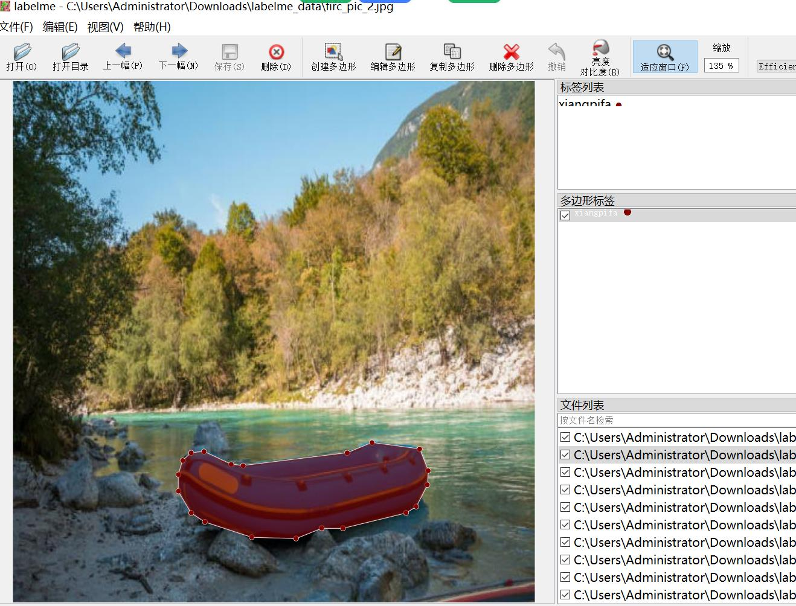

# Rubber Boat and Kayak Identification and Segmentation Data Set: LabelMe Format, 1340 Images in 2 Classes

Dataset format: LabelMe format (without mask files, only containing jpg images and corresponding json files)
Number of image files (number of jpg files): 1340
Number of annotations (json file count): 1340
Number of categories: 2
Annotation category names: ["pihuating", "xiangpifa"]
Total number of bounding boxes: 1853
Annotation tool used: labelme = 5.5.0
Image resolution: 640x640
Annotation rule: Polygons are drawn around the categories
Important note: The dataset can be opened and edited using LabelMe; however, the json dataset needs to be converted into a format such as mask or YOLOF or COCO for semantic segmentation or instance 
segmentation
Special declaration: This dataset does not guarantee the accuracy of the models trained or weight files.
Image preview:
Annotation example:
Randomly selected 16 images:
Annotation drawing results:
LabelMe editing image examples:

## Images

Here is a pay link on Stripe ( https://buy.stripe.com/3cs8yP7sY87d0vu9AB ). Please contact me lonlonago@foxmail.com after funding $89, and I will send you a complete data files , thank you!

